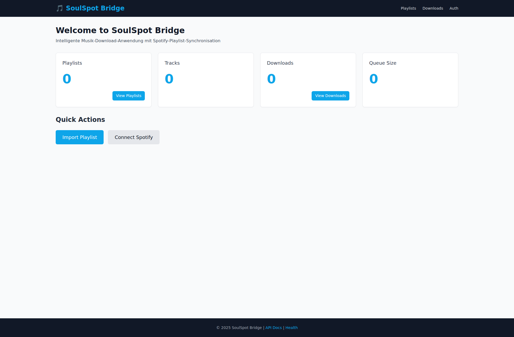
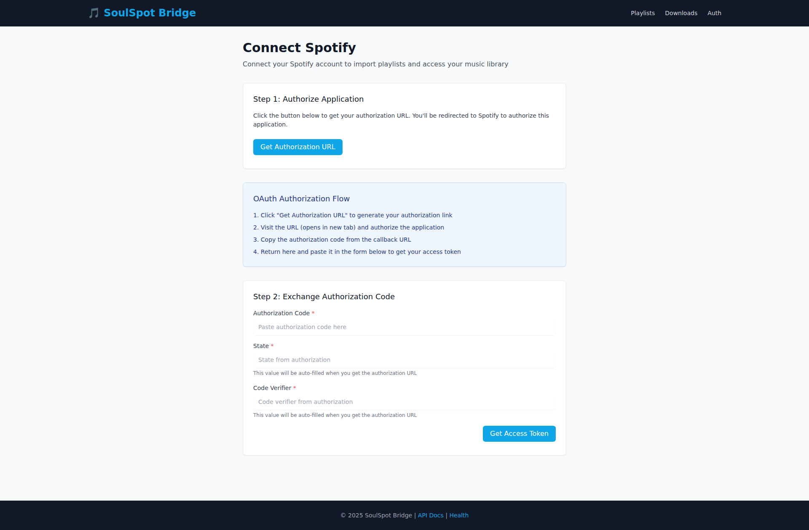
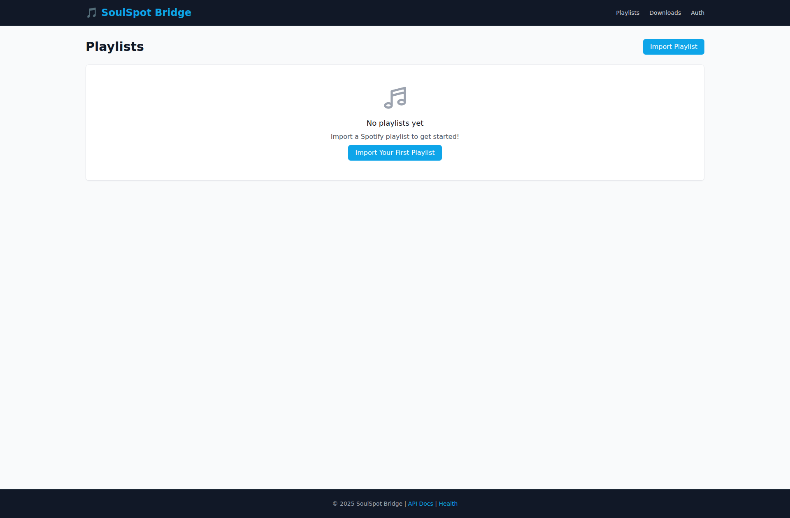
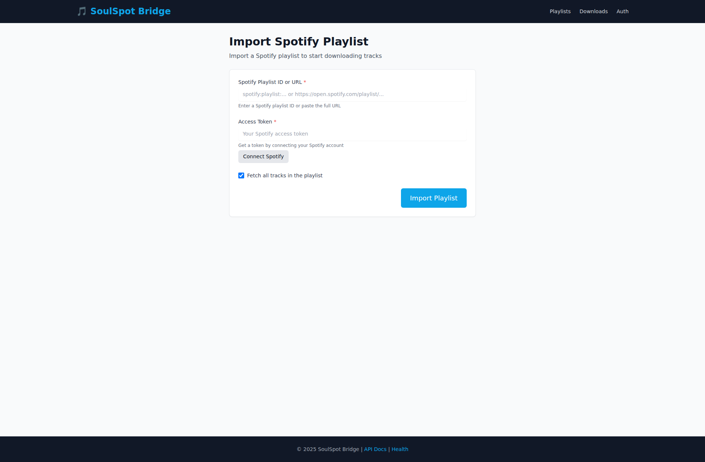
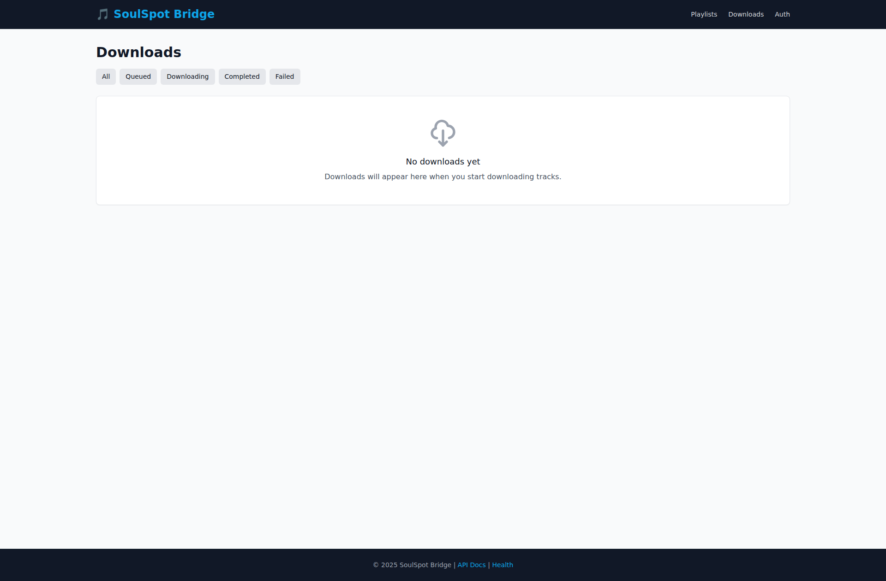

# UI Screenshots & Visual Review

> 📸 Comprehensive visual documentation of SoulSpot UI

This document provides screenshots and feature assessments for all main views of the SoulSpot web interface.

## 📋 Overview

**Capture Date:** 2025-11-11  
**Version:** 0.1.0 (Alpha)  
**Resolution:** 1920x1080  
**Browser:** Chromium 141.0.7390.37

All screenshots show the application in its current development state with empty/demo data.

---

## 🖼️ Screenshots

### 1. Dashboard (Main View)

**File:** `dashboard.png`  
**URL:** `/ui/`

**Feature Assessment:**

✅ **Complete & Working:**
- Clean, modern UI with dark theme
- Navigation bar with logo and main menu items (Playlists, Downloads, Auth)
- Statistics cards showing:
  - Playlists count (0)
  - Tracks count (0)
  - Downloads count (0)
  - Queue size (0)
- Quick action buttons:
  - "Import Playlist" (navigates to import page)
  - "Connect Spotify" (navigates to auth page)
- Footer with links to API Docs and Health endpoint
- Responsive card layout with call-to-action buttons

✅ **Visual Design:**
- Consistent Tailwind CSS styling
- Blue accent color (#0ea5e9) for primary actions
- Good contrast and readability
- Music note icon in logo
- Professional typography

⚠️ **Observations:**
- Shows empty state (0 for all stats) - expected for fresh installation
- No settings page link in navigation
- No user profile/logout functionality visible

---

### 2. Authentication Page

**File:** `auth.png`  
**URL:** `/ui/auth`

**Feature Assessment:**

✅ **Complete & Working:**
- Clear multi-step OAuth PKCE flow instructions
- Step 1: "Get Authorization URL" button
- Step 2: Form with fields for:
  - Authorization Code (with placeholder)
  - State (with auto-fill note)
  - Code Verifier (with auto-fill note)
- "Get Access Token" button
- Helpful info box explaining the OAuth flow steps:
  1. Click "Get Authorization URL"
  2. Visit URL and authorize
  3. Copy authorization code
  4. Return and paste to get access token

✅ **Visual Design:**
- Well-structured form layout
- Clear section headings (Step 1, Step 2)
- Info box with blue background for instructions
- Required field indicators (*)
- Helpful placeholder text

⚠️ **Observations:**
- OAuth flow requires manual code copying (expected for PKCE)
- No token status/validation indicator
- No "already connected" state shown
- No error handling UI visible

---

### 3. Playlists Page (Empty State)

**File:** `playlists.png`  
**URL:** `/ui/playlists`

**Feature Assessment:**

✅ **Complete & Working:**
- Empty state with music note icon
- Clear message: "No playlists yet"
- Call-to-action: "Import Your First Playlist" button
- "Import Playlist" button in header
- Clean, centered empty state design

✅ **Visual Design:**
- Large, friendly icon (music note SVG)
- Good use of whitespace
- Clear hierarchy between heading and action button
- Consistent with overall design language

⚠️ **Observations:**
- Cannot verify populated state (no data available)
- Missing features visible:
  - No search/filter functionality
  - No sorting options
  - No playlist management actions (edit, delete)
  - No pagination controls (not visible in empty state)

❓ **Needs Verification (with data):**
- Playlist card design
- Track count display
- Last updated timestamps
- Sync status indicators
- Bulk actions

---

### 4. Import Playlist Page

**File:** `import_playlist.png`  
**URL:** `/ui/playlists/import`

**Feature Assessment:**

✅ **Complete & Working:**
- Form with clear input fields:
  - Spotify Playlist ID or URL (with helpful placeholder)
  - Access Token (with link to Connect Spotify)
  - Checkbox: "Fetch all tracks in the playlist" (checked by default)
- "Import Playlist" button
- Link to Auth page if token is needed
- Helpful hint text explaining accepted formats

✅ **Visual Design:**
- Clean form layout
- Required field indicators (*)
- Gray helper text below fields
- "Connect Spotify" link styled as secondary button

⚠️ **Observations:**
- No validation preview before import
- No progress indicator for import process
- No batch import capability
- No preview of playlist info (name, track count) before confirming

❓ **Missing Features:**
- Import from playlist URL vs. ID distinction
- Import history
- Failed import retry mechanism
- Partial import handling (some tracks fail)

---

### 5. Downloads Page (Empty State)

**File:** `downloads.png`  
**URL:** `/ui/downloads`

**Feature Assessment:**

✅ **Complete & Working:**
- Filter tabs for download states:
  - All
  - Queued
  - Downloading
  - Completed
  - Failed
- Empty state with download icon
- Clear message: "No downloads yet"
- Informative text about where downloads will appear

✅ **Visual Design:**
- Tab-based filtering (inactive gray, active has bottom border)
- Large download cloud icon
- Good use of empty state pattern
- Consistent with other empty states

⚠️ **Observations:**
- Cannot verify populated state
- Missing features visible:
  - No "clear completed" action
  - No "retry all failed" action
  - No bulk cancel/pause functionality
  - No download speed/ETA indicators

❓ **Needs Verification (with data):**
- Download progress bars
- Individual download actions (pause, cancel, retry)
- Error messages for failed downloads
- Download metadata display (track name, artist, album)
- Queue order management
- Auto-refresh of download status

---

## 📊 Feature Completeness Assessment

### ✅ Fully Implemented

| Feature | Status | Notes |
|---------|--------|-------|
| Dashboard Statistics | ✅ Complete | Shows all key metrics |
| Navigation Menu | ✅ Complete | All main sections accessible |
| OAuth Authentication Flow | ✅ Complete | PKCE flow properly documented |
| Playlist Import Form | ✅ Complete | All required fields present |
| Download Filtering | ✅ Complete | All states have filter tabs |
| Empty States | ✅ Complete | User-friendly messages everywhere |
| Responsive Design | ✅ Complete | Tailwind CSS responsive utilities |

### ⚠️ Partially Implemented / Needs Data

| Feature | Status | Missing |
|---------|--------|---------|
| Playlist Management | ⚠️ Partial | No edit/delete/sync actions visible |
| Download Management | ⚠️ Partial | No individual controls visible |
| Search/Filter | ⚠️ Missing | No search bars anywhere |
| Settings Page | ❌ Missing | No settings/configuration UI |
| User Profile | ❌ Missing | No user info or logout |
| Error Handling UI | ⚠️ Unknown | Cannot verify without errors |

### ❓ Cannot Verify (Requires Active Data)

- Download progress indicators
- Playlist list view with actual playlists
- Track listings
- Real-time updates (HTMX functionality)
- Error messages and validation feedback
- Loading states and spinners
- Toast/notification system

---

## 🎨 Design System Observations

### Strengths
- ✅ Consistent color palette (blue accent, dark theme)
- ✅ Clean typography hierarchy
- ✅ Good use of whitespace
- ✅ Professional empty states
- ✅ Clear call-to-action buttons
- ✅ Logical navigation structure

### Areas for Enhancement
- 🔄 Add a settings/configuration page
- 🔄 Add user profile/session management UI
- 🔄 Add search functionality
- 🔄 Add bulk action controls
- 🔄 Add notification/toast system
- 🔄 Add dark/light theme toggle
- 🔄 Add breadcrumbs for deep navigation

---

## 🐛 Potential Issues / Questions

1. **No Settings Page:**
   - No visible way to configure:
     - Download directory
     - Music library path
     - slskd connection settings
     - MusicBrainz preferences
     - Auto-import settings

2. **No Session Management:**
   - No logout button
   - No user info display
   - No token expiration warnings

3. **Limited Playlist Management:**
   - Cannot see edit/delete options
   - No sync status
   - No manual sync trigger

4. **Download Management:**
   - No visible pause/resume controls
   - No retry mechanism for failed downloads
   - No download speed limits

5. **Search & Filtering:**
   - No search bars on any page
   - Limited filtering options

6. **Widget/Kanban View:**
   - Mentioned in problem statement but not found in UI
   - Possible Phase 7 feature?

---

## 🎯 Release Readiness Assessment

### Ready for Release
- ✅ Core navigation and page structure
- ✅ OAuth authentication flow
- ✅ Playlist import workflow
- ✅ Download tracking UI foundation
- ✅ Empty states and error-free rendering

### Needs Attention Before Release
- ⚠️ Settings/configuration page
- ⚠️ Session management (logout, token status)
- ⚠️ Search functionality
- ⚠️ Populated state testing (with real data)
- ⚠️ Error handling and validation feedback
- ⚠️ Loading states and real-time updates

### Nice-to-Have (Can be Post-Release)
- 💡 Dark/light theme toggle
- 💡 Keyboard shortcuts
- 💡 Advanced filtering
- 💡 Bulk operations
- 💡 Export functionality
- 💡 Widget/Kanban view (Phase 7)

---

## 🚀 Recommendations

1. **High Priority:**
   - Add a Settings page for configuration
   - Add session management UI (logout, token status)
   - Test with actual data to verify populated states
   - Add basic search functionality

2. **Medium Priority:**
   - Add download management controls (pause, retry)
   - Add playlist management actions (edit, delete, sync)
   - Implement error handling UI
   - Add loading indicators

3. **Low Priority:**
   - Add theme toggle
   - Add advanced filtering
   - Add bulk actions
   - Add export features

---

## 📝 Notes

- **No Real Data:** All screenshots show empty states. Populated states need verification.
- **No Sensitive Data:** All screenshots use demo/placeholder data only.
- **HTMX Integration:** Cannot verify dynamic behavior from static screenshots.
- **Performance:** Cannot assess page load times or real-time updates.
- **Accessibility:** Cannot verify keyboard navigation or screen reader support from screenshots alone.

---

## ✅ Conclusion

The SoulSpot UI is **well-designed and functional** for its current development stage. The core workflows (auth, import, downloads) are clearly implemented with good UX. The application is **nearing release-ready state** but would benefit from:

1. Settings page implementation
2. Session management UI
3. Testing with real data
4. Enhanced search and filtering

The design is clean, modern, and consistent. The empty states are user-friendly and guide users toward their first actions effectively.

**Overall Assessment:** 🟢 **Good foundation, ready for beta testing with minor enhancements**
