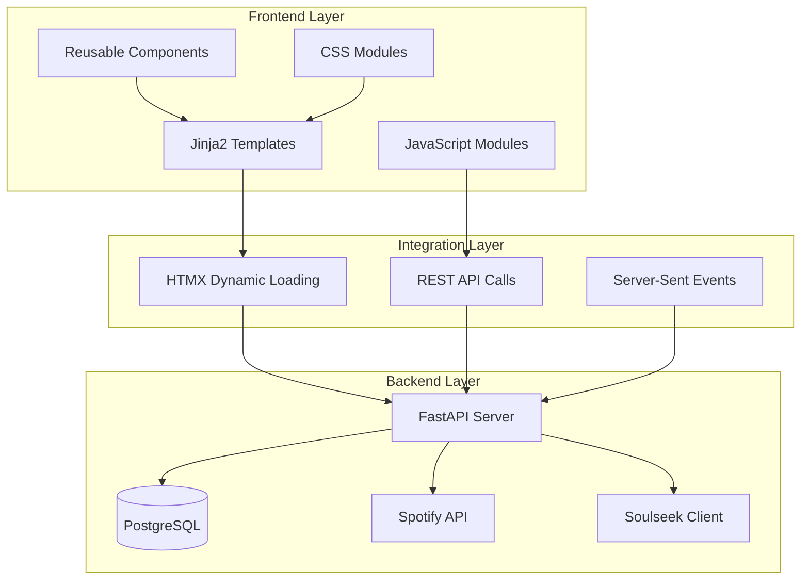
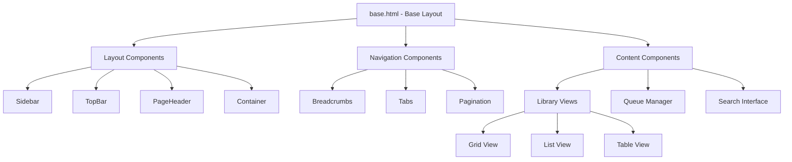

# SoulSpot UI Redesign - Technical Specification

## Document Information
- **Version**: 1.0
- **Last Updated**: 2025-11-26
- **Status**: Draft
- **Related**: [ROADMAP.md](./ROADMAP.md)

---

## Table of Contents
1. [Architecture Overview](#architecture-overview)
2. [Component System](#component-system)
3. [Design System](#design-system)
4. [State Management](#state-management)
5. [API Integration](#api-integration)
6. [Performance](#performance)
7. [Accessibility](#accessibility)
8. [Browser Support](#browser-support)

---

## Architecture Overview

### High-Level Architecture



### Technology Stack

#### Core Technologies
- **Backend**: Python 3.11+, FastAPI
- **Template Engine**: Jinja2
- **CSS Framework**: Tailwind CSS 3.x
- **JavaScript**: Vanilla ES6+ (no framework)
- **Dynamic Updates**: HTMX 1.9+
- **Icons**: Font Awesome 6
- **Fonts**: Inter (Google Fonts)

#### Build Tools
- **CSS Processing**: Tailwind CLI
- **JS Bundling**: None (vanilla JS, ES modules)
- **Asset Optimization**: Manual/script-based

---

## Component System

### Component Hierarchy



### Component Categories

#### 1. Layout Components

##### Sidebar
**Purpose**: Main navigation sidebar  
**Location**: `templates/components/layout/Sidebar.html`

**Props**:
- `active_section` (string): Currently active section
- `collapsed` (boolean): Sidebar collapsed state
- `user` (object): Current user data

**Structure**:
```html
<aside class="sidebar" data-collapsed="false">
  <div class="sidebar-header">
    <!-- Logo and branding -->
  </div>
  <nav class="sidebar-nav">
    <!-- Navigation items -->
  </nav>
  <div class="sidebar-footer">
    <!-- User menu, settings -->
  </div>
</aside>
```

**Features**:
- Collapsible on mobile/tablet
- Active state highlighting
- Nested navigation support
- Quick actions menu
- User profile section

##### TopBar
**Purpose**: Top navigation bar with search and user menu  
**Location**: `templates/components/layout/TopBar.html`

**Props**:
- `page_title` (string): Current page title
- `show_search` (boolean): Show search bar
- `user` (object): Current user data

**Features**:
- Global search
- Breadcrumbs
- User menu dropdown
- Notifications
- Theme toggle

##### PageHeader
**Purpose**: Consistent page headers with actions  
**Location**: `templates/components/layout/PageHeader.html`

**Props**:
- `title` (string): Page title
- `subtitle` (string): Optional subtitle
- `actions` (array): Action buttons
- `tabs` (array): Optional tabs

**Features**:
- Title and subtitle
- Action buttons
- Tab navigation
- Breadcrumbs integration

#### 2. Data Display Components

##### LibraryView
**Purpose**: Unified library view with multiple display modes  
**Location**: `templates/components/specialized/LibraryView.html`

**Props**:
- `items` (array): Items to display
- `view_mode` (string): 'grid' | 'list' | 'table'
- `filters` (object): Active filters
- `sort` (object): Sort configuration

**Features**:
- View mode toggle
- Filtering panel
- Sorting controls
- Batch selection
- Pagination
- Empty states

##### Card
**Purpose**: Reusable card component  
**Location**: `templates/components/data-display/Card.html`

**Props**:
- `title` (string): Card title
- `image` (string): Image URL
- `metadata` (object): Additional metadata
- `actions` (array): Action buttons
- `status` (string): Status badge

**Variants**:
- `card-artist`: Artist card
- `card-album`: Album card
- `card-playlist`: Playlist card
- `card-track`: Track card (list item)

##### Table
**Purpose**: Data table with sorting and selection  
**Location**: `templates/components/data-display/Table.html`

**Props**:
- `columns` (array): Column definitions
- `rows` (array): Row data
- `sortable` (boolean): Enable sorting
- `selectable` (boolean): Enable row selection

**Features**:
- Column sorting
- Row selection
- Pagination
- Responsive (mobile scrolling)
- Empty state

#### 3. Input Components

##### FilterPanel
**Purpose**: Advanced filtering sidebar  
**Location**: `templates/components/specialized/FilterPanel.html`

**Props**:
- `filters` (array): Available filters
- `active_filters` (object): Currently active filters

**Filter Types**:
- Text search
- Multi-select (checkboxes)
- Range (slider)
- Date range
- Status toggles

**Features**:
- Collapsible sections
- Clear all filters
- Filter count badges
- Preset filters

##### SearchBar
**Purpose**: Global search component  
**Location**: `templates/components/input/SearchBar.html`

**Props**:
- `placeholder` (string): Placeholder text
- `autofocus` (boolean): Auto-focus on load
- `suggestions` (boolean): Show suggestions

**Features**:
- Auto-complete suggestions
- Search history
- Keyboard shortcuts (Ctrl+K)
- Clear button
- Loading state

#### 4. Feedback Components

##### ProgressBar
**Purpose**: Download/upload progress indicator  
**Location**: `templates/components/feedback/ProgressBar.html`

**Props**:
- `progress` (number): 0-100
- `status` (string): 'pending' | 'active' | 'complete' | 'error'
- `label` (string): Progress label

**Features**:
- Animated progress
- Status colors
- Percentage display
- Indeterminate state

##### Toast
**Purpose**: Notification toast messages  
**Location**: `templates/components/feedback/Toast.html`

**Props**:
- `message` (string): Toast message
- `type` (string): 'success' | 'error' | 'warning' | 'info'
- `duration` (number): Auto-dismiss duration (ms)

**Features**:
- Auto-dismiss
- Manual close
- Stacking
- Action buttons

##### Modal
**Purpose**: Modal dialogs  
**Location**: `templates/components/feedback/Modal.html`

**Props**:
- `title` (string): Modal title
- `size` (string): 'sm' | 'md' | 'lg' | 'xl'
- `closable` (boolean): Show close button

**Features**:
- Backdrop click to close
- ESC key to close
- Focus trap
- Scrollable content
- Footer actions

#### 5. Specialized Components

##### QueueManager
**Purpose**: Download queue management interface  
**Location**: `templates/components/specialized/QueueManager.html`

**Props**:
- `queue_items` (array): Queue items
- `active_downloads` (number): Active download count
- `max_concurrent` (number): Max concurrent downloads

**Features**:
- Priority management
- Pause/resume
- Cancel downloads
- Retry failed
- Clear completed
- Real-time updates

##### ActivityFeed
**Purpose**: Real-time activity stream  
**Location**: `templates/components/specialized/ActivityFeed.html`

**Props**:
- `activities` (array): Activity items
- `filters` (array): Activity type filters

**Features**:
- Real-time updates (SSE)
- Activity filtering
- Timestamp formatting
- Infinite scroll
- Empty state

---

## Design System

### CSS Architecture

#### File Structure
```
static/css/
├── base/
│   ├── reset.css           # CSS reset
│   ├── variables.css       # CSS custom properties
│   └── typography.css      # Font and text styles
├── components/
│   ├── layout.css          # Layout components
│   ├── navigation.css      # Navigation components
│   ├── cards.css           # Card components
│   ├── buttons.css         # Button components
│   ├── forms.css           # Form components
│   ├── tables.css          # Table components
│   └── specialized.css     # Specialized components
├── utilities/
│   ├── spacing.css         # Spacing utilities
│   ├── colors.css          # Color utilities
│   └── effects.css         # Visual effects
└── main.css                # Main entry point
```

#### CSS Custom Properties

**Colors**:
```css
:root {
  /* Brand Colors */
  --color-primary: #fe4155;
  --color-primary-hover: #982633;
  --color-secondary: #533c5b;
  --color-secondary-hover: #332538;
  
  /* Semantic Colors */
  --color-success: #10b981;
  --color-warning: #f59e0b;
  --color-danger: #ef4444;
  --color-info: #3b82f6;
  
  /* Neutral Colors (Dark Mode) */
  --color-bg: #111827;
  --color-surface: #1f2937;
  --color-surface-alt: #374151;
  --color-border: #4b5563;
  --color-text: #f9fafb;
  --color-text-muted: #9ca3af;
  
  /* Effects */
  --glass-bg: rgba(31, 41, 55, 0.8);
  --glass-border: rgba(255, 255, 255, 0.1);
  --glass-blur: blur(10px);
}
```

**Spacing**:
```css
:root {
  --space-xs: 0.25rem;   /* 4px */
  --space-sm: 0.5rem;    /* 8px */
  --space-md: 1rem;      /* 16px */
  --space-lg: 1.5rem;    /* 24px */
  --space-xl: 2rem;      /* 32px */
  --space-2xl: 2.5rem;   /* 40px */
}
```

**Typography**:
```css
:root {
  --font-family: "Inter", -apple-system, BlinkMacSystemFont, "Segoe UI", system-ui, sans-serif;
  
  --font-size-xs: 0.75rem;    /* 12px */
  --font-size-sm: 0.875rem;   /* 14px */
  --font-size-base: 1rem;     /* 16px */
  --font-size-lg: 1.125rem;   /* 18px */
  --font-size-xl: 1.25rem;    /* 20px */
  --font-size-2xl: 1.5rem;    /* 24px */
  --font-size-3xl: 1.875rem;  /* 30px */
  --font-size-4xl: 2.25rem;   /* 36px */
  
  --font-weight-normal: 400;
  --font-weight-medium: 500;
  --font-weight-semibold: 600;
  --font-weight-bold: 700;
}
```

### Component Classes

#### Button System
```css
/* Base button */
.btn {
  display: inline-flex;
  align-items: center;
  gap: var(--space-sm);
  padding: var(--space-sm) var(--space-md);
  border-radius: var(--radius-md);
  font-weight: var(--font-weight-medium);
  transition: all var(--transition-normal);
}

/* Variants */
.btn-primary { /* Primary action */ }
.btn-secondary { /* Secondary action */ }
.btn-outline { /* Outline style */ }
.btn-ghost { /* Ghost/text style */ }
.btn-danger { /* Destructive action */ }

/* Sizes */
.btn-sm { /* Small button */ }
.btn-lg { /* Large button */ }

/* States */
.btn:hover { /* Hover state */ }
.btn:disabled { /* Disabled state */ }
.btn.loading { /* Loading state */ }
```

#### Card System
```css
/* Base card */
.card {
  background: var(--color-surface);
  border: 1px solid var(--color-border);
  border-radius: var(--radius-lg);
  padding: var(--space-lg);
  transition: all var(--transition-normal);
}

/* Variants */
.card-glass { /* Glassmorphism effect */ }
.card-hover { /* Hover effect */ }

/* Card sections */
.card-header { /* Card header */ }
.card-body { /* Card body */ }
.card-footer { /* Card footer */ }
```

---

## State Management

### Client-Side State

#### Approach
**Minimal client-side state** - Rely on server state via HTMX

**State Categories**:
1. **UI State**: View modes, filters, sort order
2. **Session State**: User preferences, theme
3. **Transient State**: Modals, dropdowns, tooltips

#### Storage
- **LocalStorage**: User preferences, theme, view modes
- **SessionStorage**: Temporary filters, search history
- **URL Parameters**: Shareable state (filters, sort, page)

#### State Management Pattern
```javascript
// State manager
const State = {
  // Get state
  get(key, defaultValue = null) {
    const value = localStorage.getItem(key);
    return value ? JSON.parse(value) : defaultValue;
  },
  
  // Set state
  set(key, value) {
    localStorage.setItem(key, JSON.stringify(value));
    this.emit('change', { key, value });
  },
  
  // Event emitter
  listeners: {},
  on(event, callback) {
    if (!this.listeners[event]) this.listeners[event] = [];
    this.listeners[event].push(callback);
  },
  emit(event, data) {
    if (this.listeners[event]) {
      this.listeners[event].forEach(cb => cb(data));
    }
  }
};

// Usage
State.set('viewMode', 'grid');
State.on('change', ({ key, value }) => {
  if (key === 'viewMode') {
    updateView(value);
  }
});
```

### Server-Side State

#### Session Management
- **FastAPI Sessions**: User authentication, Spotify tokens
- **Database**: Persistent data (playlists, library, downloads)

#### Real-Time Updates
- **Server-Sent Events (SSE)**: Live activity feed, download progress
- **HTMX Polling**: Periodic updates for queue status

---

## API Integration

### REST API Endpoints

#### Library Endpoints
```
GET    /api/library/artists          # List artists
GET    /api/library/artists/:id      # Get artist details
GET    /api/library/albums           # List albums
GET    /api/library/albums/:id       # Get album details
GET    /api/library/tracks           # List tracks
GET    /api/library/tracks/:id       # Get track details
```

#### Playlist Endpoints
```
GET    /api/playlists                # List playlists
POST   /api/playlists                # Create playlist
GET    /api/playlists/:id            # Get playlist details
PUT    /api/playlists/:id            # Update playlist
DELETE /api/playlists/:id            # Delete playlist
POST   /api/playlists/import         # Import from Spotify
```

#### Download Endpoints
```
GET    /api/downloads/queue          # Get download queue
POST   /api/downloads/queue          # Add to queue
PUT    /api/downloads/queue/:id      # Update queue item
DELETE /api/downloads/queue/:id      # Remove from queue
POST   /api/downloads/queue/batch    # Batch operations
GET    /api/downloads/history        # Download history
```

#### Search Endpoints
```
GET    /api/search                   # Unified search
GET    /api/search/artists           # Search artists
GET    /api/search/albums            # Search albums
GET    /api/search/tracks            # Search tracks
```

### HTMX Integration

#### Patterns

**Partial Updates**:
```html
<div hx-get="/api/library/artists" 
     hx-trigger="load" 
     hx-swap="innerHTML">
  <!-- Loading state -->
</div>
```

**Form Submission**:
```html
<form hx-post="/api/playlists/import" 
      hx-swap="outerHTML">
  <!-- Form fields -->
</form>
```

**Infinite Scroll**:
```html
<div hx-get="/api/library/artists?page=2" 
     hx-trigger="revealed" 
     hx-swap="afterend">
  <!-- Trigger element -->
</div>
```

**Real-Time Updates**:
```html
<div hx-get="/api/downloads/queue" 
     hx-trigger="every 2s">
  <!-- Queue status -->
</div>
```

### Server-Sent Events

#### Activity Feed
```javascript
const eventSource = new EventSource('/api/activity/stream');

eventSource.addEventListener('activity', (event) => {
  const activity = JSON.parse(event.data);
  updateActivityFeed(activity);
});

eventSource.addEventListener('download_progress', (event) => {
  const progress = JSON.parse(event.data);
  updateDownloadProgress(progress);
});
```

---

## Performance

### Optimization Strategies

#### 1. **CSS Optimization**
- Purge unused Tailwind classes
- Minimize CSS files
- Use CSS containment
- Lazy-load non-critical CSS

#### 2. **JavaScript Optimization**
- ES modules for code splitting
- Defer non-critical scripts
- Minimize JavaScript usage
- Use HTMX for dynamic content

#### 3. **Image Optimization**
- Lazy-load images
- Use WebP format
- Responsive images (srcset)
- Placeholder images

#### 4. **Caching Strategy**
- Service Worker for offline support
- Cache static assets
- Cache API responses
- Invalidate on updates

#### 5. **Rendering Performance**
- Virtual scrolling for long lists
- Pagination for large datasets
- Debounce search inputs
- Throttle scroll events

### Performance Targets

| Metric | Target | Tool |
|--------|--------|------|
| First Contentful Paint | < 1.5s | Lighthouse |
| Time to Interactive | < 3s | Lighthouse |
| Largest Contentful Paint | < 2.5s | Lighthouse |
| Cumulative Layout Shift | < 0.1 | Lighthouse |
| Total Blocking Time | < 300ms | Lighthouse |

---

## Accessibility

### WCAG 2.1 AA Compliance

#### 1. **Perceivable**
- ✅ Color contrast ratios (4.5:1 for text)
- ✅ Alternative text for images
- ✅ Captions for media
- ✅ Semantic HTML structure

#### 2. **Operable**
- ✅ Keyboard navigation
- ✅ Focus indicators
- ✅ Skip links
- ✅ No keyboard traps

#### 3. **Understandable**
- ✅ Clear labels and instructions
- ✅ Error messages
- ✅ Consistent navigation
- ✅ Predictable behavior

#### 4. **Robust**
- ✅ Valid HTML
- ✅ ARIA attributes
- ✅ Screen reader support
- ✅ Browser compatibility

### Implementation

#### Semantic HTML
```html
<nav aria-label="Main navigation">
  <ul>
    <li><a href="/dashboard">Dashboard</a></li>
    <li><a href="/library">Library</a></li>
  </ul>
</nav>
```

#### ARIA Attributes
```html
<button aria-label="Close modal" 
        aria-expanded="true">
  <i class="fa-solid fa-times"></i>
</button>
```

#### Keyboard Navigation
```javascript
// Keyboard shortcuts
document.addEventListener('keydown', (e) => {
  // Ctrl+K: Open search
  if (e.ctrlKey && e.key === 'k') {
    e.preventDefault();
    openSearch();
  }
  
  // ESC: Close modal
  if (e.key === 'Escape') {
    closeModal();
  }
});
```

#### Focus Management
```javascript
// Trap focus in modal
function trapFocus(element) {
  const focusableElements = element.querySelectorAll(
    'a, button, input, textarea, select, [tabindex]:not([tabindex="-1"])'
  );
  
  const firstElement = focusableElements[0];
  const lastElement = focusableElements[focusableElements.length - 1];
  
  element.addEventListener('keydown', (e) => {
    if (e.key === 'Tab') {
      if (e.shiftKey && document.activeElement === firstElement) {
        e.preventDefault();
        lastElement.focus();
      } else if (!e.shiftKey && document.activeElement === lastElement) {
        e.preventDefault();
        firstElement.focus();
      }
    }
  });
}
```

---

## Browser Support

### Target Browsers

| Browser | Minimum Version |
|---------|----------------|
| Chrome | 90+ |
| Firefox | 88+ |
| Safari | 14+ |
| Edge | 90+ |

### Feature Detection

```javascript
// Check for required features
const hasRequiredFeatures = () => {
  return (
    'fetch' in window &&
    'Promise' in window &&
    'IntersectionObserver' in window &&
    'EventSource' in window
  );
};

if (!hasRequiredFeatures()) {
  // Show upgrade message
  showBrowserUpgradeMessage();
}
```

### Progressive Enhancement

1. **Base Experience**: Works without JavaScript
2. **Enhanced Experience**: HTMX for dynamic updates
3. **Premium Experience**: Full JavaScript features

---

## Testing Strategy

### Unit Testing
- **JavaScript**: Jest or Vitest
- **Python**: pytest
- **Coverage Target**: 80%+

### Integration Testing
- **API Endpoints**: pytest with FastAPI TestClient
- **HTMX Interactions**: Playwright or Cypress

### E2E Testing
- **Tool**: Playwright
- **Scenarios**: Critical user flows

### Accessibility Testing
- **Automated**: axe-core, Lighthouse
- **Manual**: Screen reader testing (NVDA, VoiceOver)

### Performance Testing
- **Tool**: Lighthouse CI
- **Metrics**: Core Web Vitals

---

## Security Considerations

### 1. **Authentication**
- Secure session management
- CSRF protection
- Secure cookie flags

### 2. **Authorization**
- Role-based access control
- API endpoint protection
- Resource ownership validation

### 3. **Input Validation**
- Server-side validation
- XSS prevention
- SQL injection prevention

### 4. **Content Security Policy**
```html
<meta http-equiv="Content-Security-Policy" 
      content="default-src 'self'; 
               script-src 'self' 'unsafe-inline'; 
               style-src 'self' 'unsafe-inline' fonts.googleapis.com; 
               font-src 'self' fonts.gstatic.com;">
```

---

## Deployment

### Build Process
1. Compile Tailwind CSS
2. Minify CSS and JavaScript
3. Optimize images
4. Generate cache manifests

### Environment Variables
```bash
# Application
APP_ENV=production
DEBUG=false

# Database
DATABASE_URL=postgresql://...

# Spotify
SPOTIFY_CLIENT_ID=...
SPOTIFY_CLIENT_SECRET=...

# Soulseek
SOULSEEK_USERNAME=...
SOULSEEK_PASSWORD=...
```

### Docker Deployment
```dockerfile
FROM python:3.11-slim

# Install dependencies
COPY requirements.txt .
RUN pip install -r requirements.txt

# Copy application
COPY . /app
WORKDIR /app

# Build frontend assets
RUN npm run build

# Run application
CMD ["uvicorn", "soulspot.main:app", "--host", "0.0.0.0", "--port", "8000"]
```

---

## Monitoring & Logging

### Application Logging
- **Tool**: Python logging module
- **Levels**: DEBUG, INFO, WARNING, ERROR, CRITICAL
- **Format**: JSON structured logs

### Error Tracking
- **Tool**: Sentry (optional)
- **Scope**: Frontend and backend errors

### Performance Monitoring
- **Tool**: Prometheus + Grafana (optional)
- **Metrics**: Request latency, error rates, resource usage

---

## Documentation

### Developer Documentation
- Component API reference
- CSS class reference
- JavaScript module documentation
- API endpoint documentation

### User Documentation
- User guide
- Feature tutorials
- Troubleshooting guide
- FAQ

---

**Document Version**: 1.0  
**Last Updated**: 2025-11-26  
**Status**: Draft - Awaiting Approval
