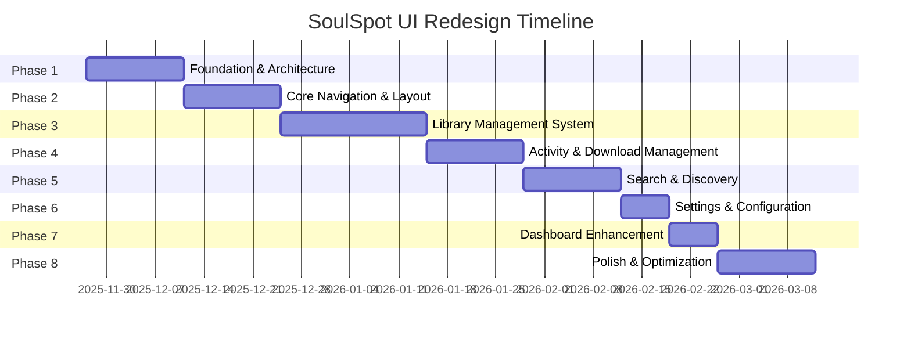
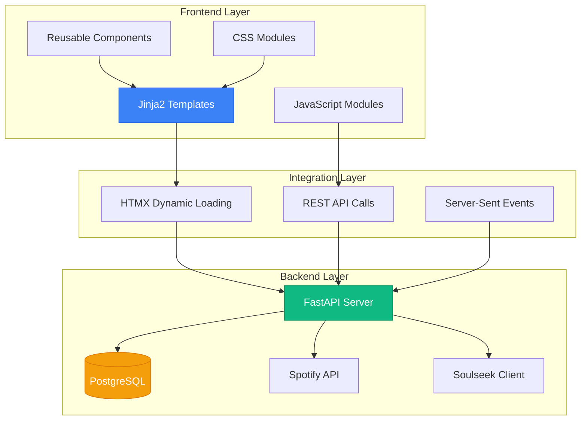
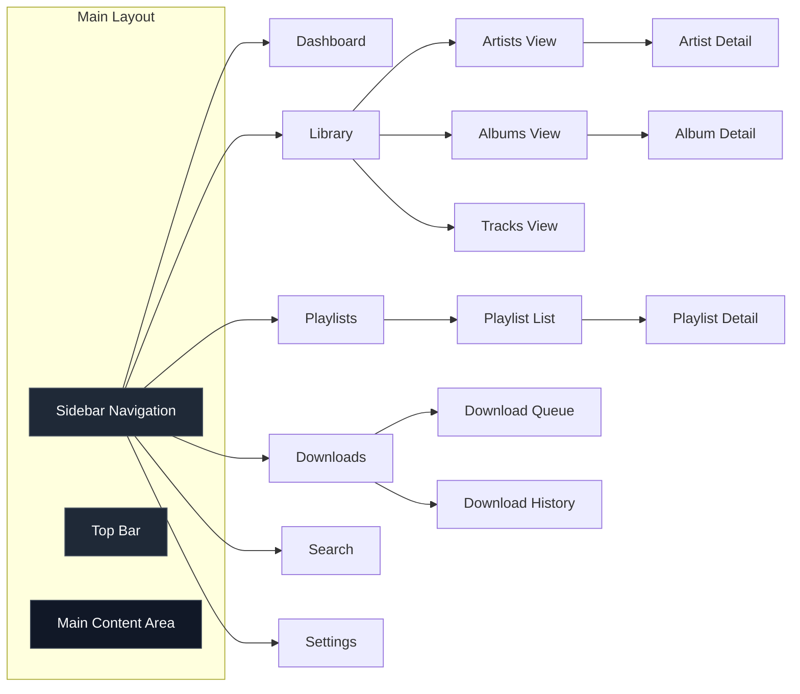
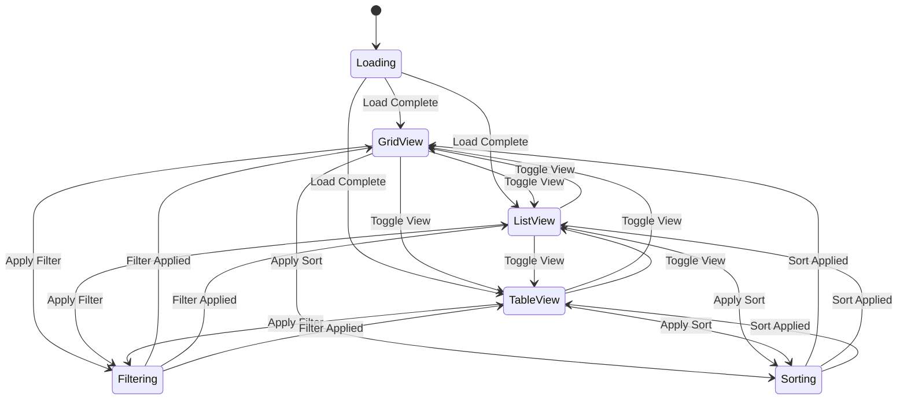
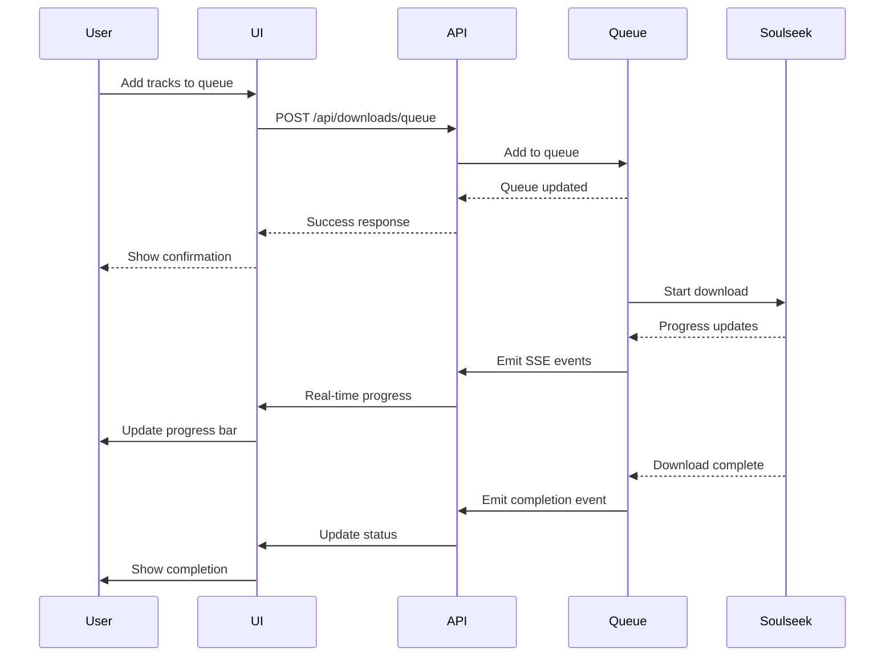
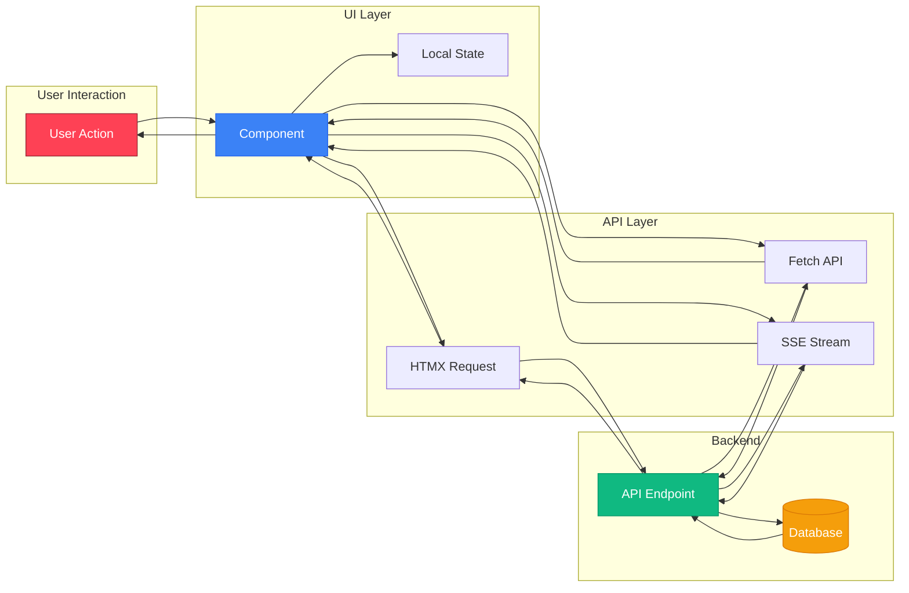
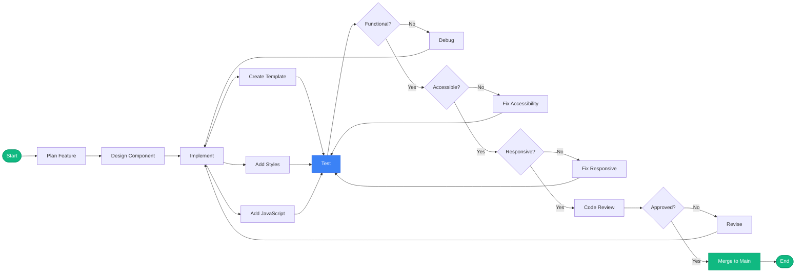
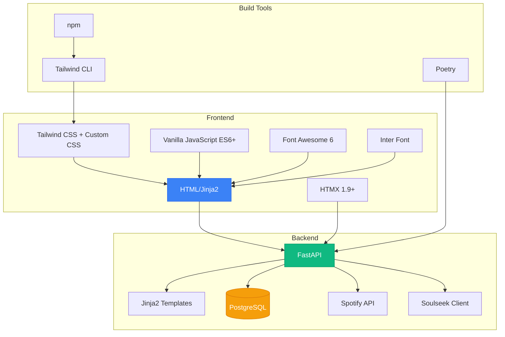

# SoulSpot UI Redesign - Visual Overview

## Document Information
- **Version**: 1.0
- **Last Updated**: 2025-11-26
- **Status**: Draft

---

## Project Timeline



---

## Component Hierarchy

```mermaid
graph TB
    Base[base.html - Base Layout]
    
    Base --> Layout[Layout Components]
    Base --> Navigation[Navigation Components]
    Base --> DataDisplay[Data Display Components]
    Base --> Input[Input Components]
    Base --> Feedback[Feedback Components]
    Base --> Specialized[Specialized Components]
    
    Layout --> Sidebar[Sidebar]
    Layout --> TopBar[TopBar]
    Layout --> PageHeader[PageHeader]
    Layout --> Container[Container]
    
    Navigation --> Breadcrumbs[Breadcrumbs]
    Navigation --> Tabs[Tabs]
    Navigation --> Pagination[Pagination]
    
    DataDisplay --> Card[Card]
    DataDisplay --> Table[Table]
    DataDisplay --> Grid[Grid]
    DataDisplay --> Badge[Badge]
    
    Input --> Button[Button]
    Input --> InputField[Input]
    Input --> Select[Select]
    Input --> FilterPanel[FilterPanel]
    Input --> SearchBar[SearchBar]
    
    Feedback --> Alert[Alert]
    Feedback --> Toast[Toast]
    Feedback --> Modal[Modal]
    Feedback --> Loading[Loading]
    Feedback --> ProgressBar[ProgressBar]
    
    Specialized --> LibraryView[LibraryView]
    Specialized --> QueueManager[QueueManager]
    Specialized --> ActivityFeed[ActivityFeed]
    
    style Base fill:#fe4155,stroke:#982633,color:#fff
    style Layout fill:#533c5b,stroke:#332538,color:#fff
    style Navigation fill:#533c5b,stroke:#332538,color:#fff
    style DataDisplay fill:#533c5b,stroke:#332538,color:#fff
    style Input fill:#533c5b,stroke:#332538,color:#fff
    style Feedback fill:#533c5b,stroke:#332538,color:#fff
    style Specialized fill:#533c5b,stroke:#332538,color:#fff
```



---

## Application Architecture



---

## Page Structure



---

## Library View States



---

## Download Queue Flow



---

## Component Data Flow



---

## Design System Hierarchy

```mermaid
graph TB
    DesignSystem[Design System]
    
    DesignSystem --> Colors[Colors]
    DesignSystem --> Typography[Typography]
    DesignSystem --> Spacing[Spacing]
    DesignSystem --> Components[Components]
    
    Colors --> Brand[Brand Colors]
    Colors --> Semantic[Semantic Colors]
    Colors --> Neutral[Neutral Colors]
    
    Brand --> Primary[Primary: #fe4155]
    Brand --> Secondary[Secondary: #533c5b]
    
    Semantic --> Success[Success: #10b981]
    Semantic --> Warning[Warning: #f59e0b]
    Semantic --> Danger[Danger: #ef4444]
    Semantic --> Info[Info: #3b82f6]
    
    Neutral --> Background[Background: #111827]
    Neutral --> Surface[Surface: #1f2937]
    Neutral --> Text[Text: #f9fafb]
    
    Typography --> FontFamily[Font: Inter]
    Typography --> FontSizes[Sizes: xs-5xl]
    Typography --> FontWeights[Weights: 400-700]
    
    Spacing --> BaseUnit[Base: 4px]
    Spacing --> Scale[Scale: xs-4xl]
    
    Components --> Layout[Layout]
    Components --> Navigation[Navigation]
    Components --> DataDisplay[Data Display]
    Components --> Input[Input]
    Components --> Feedback[Feedback]
    
    style DesignSystem fill:#fe4155,stroke:#982633,color:#fff
    style Colors fill:#533c5b,stroke:#332538,color:#fff
    style Typography fill:#533c5b,stroke:#332538,color:#fff
    style Spacing fill:#533c5b,stroke:#332538,color:#fff
    style Components fill:#533c5b,stroke:#332538,color:#fff
```



---

## Development Workflow



---

## File Structure

```
docs/feat-ui/
├── README.md                    # Overview and index
├── ROADMAP.md                   # Complete project roadmap
├── TECHNICAL_SPEC.md            # Technical specification
├── DESIGN_SYSTEM.md             # Design system documentation
├── COMPONENT_LIBRARY.md         # Component library reference
├── IMPLEMENTATION_GUIDE.md      # Implementation guide
└── VISUAL_OVERVIEW.md           # This file

src/soulspot/
├── templates/
│   ├── base.html
│   ├── components/
│   │   ├── layout/
│   │   ├── navigation/
│   │   ├── data-display/
│   │   ├── input/
│   │   ├── feedback/
│   │   └── specialized/
│   ├── pages/
│   │   ├── dashboard.html
│   │   ├── library/
│   │   ├── playlists/
│   │   ├── downloads/
│   │   ├── search.html
│   │   └── settings.html
│   └── includes/
├── static/
│   ├── css/
│   │   ├── base/
│   │   ├── components/
│   │   ├── utilities/
│   │   └── main.css
│   ├── js/
│   │   ├── core/
│   │   ├── components/
│   │   └── utils/
│   └── assets/
└── api/
    └── routers/
        └── ui.py
```

---

## Technology Stack Overview



---

**Document Version**: 1.0  
**Last Updated**: 2025-11-26  
**Status**: Draft
