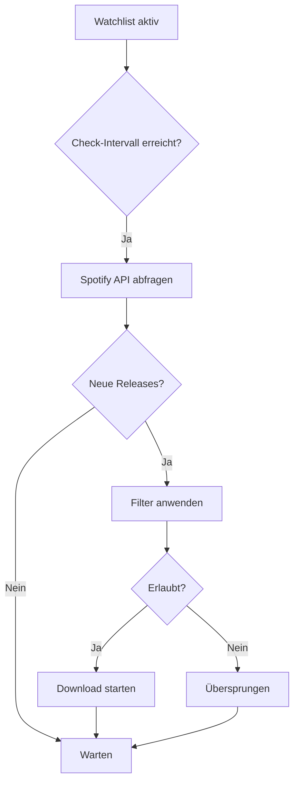

# Automation & Watchlists

> **Version:** 1.0  
> **Last Updated:** 2025-11-25

---

## Übersicht

Das Automation-System ermöglicht automatisierte Downloads basierend auf Regeln, Watchlists und Filtern. Du kannst Artist-Watchlists erstellen, um neue Releases automatisch herunterzuladen, und Filter definieren, um bestimmte Quellen zu bevorzugen oder auszuschließen.

---

## Features

### Artist Watchlists

Überwache Künstler auf neue Releases:

- **Automatische Checks**: Regelmäßige Prüfung auf neue Alben/Singles
- **Auto-Download**: Neue Releases werden automatisch heruntergeladen
- **Qualitätsprofile**: Konfigurierbare Qualitätseinstellungen pro Watchlist

### Filter-Regeln

Steuere, welche Downloads erlaubt sind:

- **Whitelist**: Nur Downloads erlauben, die einem Muster entsprechen
- **Blacklist**: Downloads blockieren, die einem Muster entsprechen
- **Regex-Support**: Muster mit regulären Ausdrücken definieren

### Automation Rules

Definiere komplexe Workflows:

- **Trigger**: Was löst die Regel aus? (neue Release, fehlende Alben, etc.)
- **Actions**: Was soll passieren? (Download starten, nur benachrichtigen, etc.)

### Discography Check

Prüfe, ob du alle Alben eines Künstlers hast:

- **Vollständigkeitsprüfung**: Vergleich mit Spotify-Discographie
- **Fehlende Alben**: Liste aller Alben, die dir fehlen

### Quality Upgrades

Identifiziere Tracks für Qualitäts-Upgrades:

- **Upgrade-Kandidaten**: Finde Tracks mit niedriger Qualität
- **Automatische Upgrades**: Optional automatische Neu-Downloads

---

## Nutzung über die Web-UI

### Watchlist erstellen

1. Navigiere zu **Automation** → **Watchlists**
2. Klicke auf **Create Watchlist**
3. Wähle einen Artist
4. Konfiguriere die Einstellungen:
   - **Check-Intervall**: Wie oft prüfen (mindestens 1 Stunde)
   - **Auto-Download**: Automatisch herunterladen oder nur benachrichtigen
   - **Qualitätsprofil**: `low`, `medium`, `high`, `lossless`
5. Klicke auf **Create**

> **Hinweis aus Quellcode:** Qualitätsprofile sind strikt validiert: nur `low`, `medium`, `high`, `lossless` sind erlaubt. Andere Werte führen zu einem Validierungsfehler.

### Filter erstellen

1. Navigiere zu **Automation** → **Filters**
2. Klicke auf **Create Filter**
3. Konfiguriere den Filter:
   - **Name**: Beschreibender Name
   - **Typ**: Whitelist oder Blacklist
   - **Target**: Was soll gefiltert werden? (Keyword, User, Format, Bitrate)
   - **Pattern**: Das Muster zum Abgleich
   - **Regex**: Ist das Muster ein regulärer Ausdruck?
4. Klicke auf **Create**

### Automation Rule erstellen

1. Navigiere zu **Automation** → **Rules**
2. Klicke auf **Create Rule**
3. Konfiguriere die Regel:
   - **Name**: Beschreibender Name
   - **Trigger**: `new_release`, `missing_album`, `quality_upgrade`, `manual`
   - **Action**: `search_and_download`, `notify_only`, `add_to_queue`
   - **Apply Filters**: Filter anwenden?
   - **Auto-Process**: Automatisch ausführen?
4. Klicke auf **Create**

---

## API-Endpunkte

### Watchlist-Endpunkte

#### POST `/api/automation/watchlist`

Erstellt eine neue Watchlist.

**Request:**
```json
{
  "artist_id": "artist-uuid",
  "check_frequency_hours": 24,
  "auto_download": true,
  "quality_profile": "high"
}
```

> **Aus Quellcode:** `check_frequency_hours` muss mindestens 1 sein. `quality_profile` muss einer von `low`, `medium`, `high`, `lossless` sein.

**Response:**
```json
{
  "id": "watchlist-uuid",
  "artist_id": "artist-uuid",
  "status": "active",
  "check_frequency_hours": 24,
  "auto_download": true,
  "quality_profile": "high",
  "last_checked_at": null,
  "last_release_date": null,
  "total_releases_found": 0,
  "total_downloads_triggered": 0,
  "created_at": "2025-01-15T10:00:00Z"
}
```

#### GET `/api/automation/watchlist`

Listet alle Watchlists auf.

**Query-Parameter:**
| Parameter | Typ | Default | Beschreibung |
|-----------|-----|---------|--------------|
| `limit` | int | 100 | Maximale Anzahl |
| `offset` | int | 0 | Offset für Pagination |
| `active_only` | bool | false | Nur aktive Watchlists |

#### GET `/api/automation/watchlist/{watchlist_id}`

Ruft Details einer Watchlist ab.

#### POST `/api/automation/watchlist/{watchlist_id}/check`

Prüft manuell auf neue Releases.

**Response:**
```json
{
  "watchlist_id": "watchlist-uuid",
  "releases_found": 2,
  "releases": [
    {
      "name": "New Album",
      "type": "album",
      "release_date": "2025-01-10"
    }
  ]
}
```

#### DELETE `/api/automation/watchlist/{watchlist_id}`

Löscht eine Watchlist.

---

### Filter-Endpunkte

#### POST `/api/automation/filters`

Erstellt einen Filter.

**Request:**
```json
{
  "name": "Block Low Bitrate",
  "filter_type": "blacklist",
  "target": "bitrate",
  "pattern": "128",
  "is_regex": false,
  "priority": 10,
  "description": "Blockiert 128kbps Downloads"
}
```

#### GET `/api/automation/filters`

Listet alle Filter auf.

**Query-Parameter:**
| Parameter | Typ | Default | Beschreibung |
|-----------|-----|---------|--------------|
| `filter_type` | string | null | Filter nach Typ (whitelist/blacklist) |
| `enabled_only` | bool | false | Nur aktivierte Filter |

#### GET `/api/automation/filters/{filter_id}`

Ruft einen Filter ab.

#### POST `/api/automation/filters/{filter_id}/enable`

Aktiviert einen Filter.

#### POST `/api/automation/filters/{filter_id}/disable`

Deaktiviert einen Filter.

#### PATCH `/api/automation/filters/{filter_id}`

Aktualisiert das Muster eines Filters.

**Request:**
```json
{
  "pattern": "\\b128\\b",
  "is_regex": true
}
```

#### DELETE `/api/automation/filters/{filter_id}`

Löscht einen Filter.

---

### Automation Rules Endpunkte

#### POST `/api/automation/rules`

Erstellt eine Automation Rule.

**Request:**
```json
{
  "name": "Auto-Download New Releases",
  "trigger": "new_release",
  "action": "search_and_download",
  "priority": 0,
  "quality_profile": "high",
  "apply_filters": true,
  "auto_process": true,
  "description": "Lädt neue Releases automatisch herunter"
}
```

#### GET `/api/automation/rules`

Listet alle Automation Rules auf.

#### GET `/api/automation/rules/{rule_id}`

Ruft Details einer Rule ab.

#### POST `/api/automation/rules/{rule_id}/enable`

Aktiviert eine Rule.

#### POST `/api/automation/rules/{rule_id}/disable`

Deaktiviert eine Rule.

#### DELETE `/api/automation/rules/{rule_id}`

Löscht eine Rule.

---

### Discography-Endpunkte

#### POST `/api/automation/discography/check`

Prüft die Vollständigkeit einer Discographie.

**Request:**
```json
{
  "artist_id": "artist-uuid"
}
```

**Response:**
```json
{
  "artist_id": "artist-uuid",
  "total_albums": 10,
  "owned_albums": 7,
  "missing_albums": [
    {
      "name": "Album Name",
      "release_date": "2020-05-15",
      "spotify_uri": "spotify:album:xyz"
    }
  ],
  "completeness_percent": 70
}
```

#### GET `/api/automation/discography/missing`

Gibt fehlende Alben für alle Artists zurück.

**Query-Parameter:**
| Parameter | Typ | Default | Beschreibung |
|-----------|-----|---------|--------------|
| `limit` | int | 10 | Maximale Artists zu prüfen |

---

### Quality Upgrade Endpunkte

#### POST `/api/automation/quality-upgrades/identify`

Identifiziert Tracks für Qualitäts-Upgrades.

**Request:**
```json
{
  "quality_profile": "high",
  "min_improvement_score": 0.3,
  "limit": 100
}
```

**Response:**
```json
{
  "candidates": [
    {
      "track_id": "track-uuid",
      "current_quality": "mp3_128",
      "target_quality": "flac",
      "improvement_score": 0.8
    }
  ],
  "count": 15,
  "quality_profile": "high",
  "min_improvement_score": 0.3
}
```

#### GET `/api/automation/quality-upgrades/unprocessed`

Listet unverarbeitete Upgrade-Kandidaten auf.

---

## Filter-Konfiguration

### Filter-Typen

| Typ | Beschreibung |
|-----|--------------|
| `whitelist` | Nur Downloads erlauben, die matchen |
| `blacklist` | Downloads blockieren, die matchen |

### Filter-Targets

| Target | Beschreibung | Beispiel-Pattern |
|--------|--------------|------------------|
| `keyword` | Suche im Dateinamen | `bootleg`, `live` |
| `user` | Soulseek-Benutzername | `spammer123` |
| `format` | Dateiformat | `mp3`, `flac` |
| `bitrate` | Bitrate | `128`, `320` |

### Priorität

Höhere Priorität = wird zuerst ausgewertet. Bei Konflikten zwischen Whitelist und Blacklist gewinnt die höhere Priorität.

---

## Workflow-Beispiele

### Automatischer Release-Download



### Filter-Beispiel: Nur FLAC erlauben

```json
{
  "name": "Only FLAC",
  "filter_type": "whitelist",
  "target": "format",
  "pattern": "flac",
  "priority": 100
}
```

### Filter-Beispiel: Bootlegs blockieren

```json
{
  "name": "Block Bootlegs",
  "filter_type": "blacklist",
  "target": "keyword",
  "pattern": "bootleg|unofficial|live",
  "is_regex": true,
  "priority": 50
}
```

---

## Troubleshooting

### Problem: Watchlist prüft nicht automatisch

**Mögliche Ursachen:**
1. **Status ist nicht "active"**: Prüfe den Watchlist-Status
2. **Worker nicht gestartet**: Background-Worker muss laufen
3. **Token abgelaufen**: Spotify-Token muss gültig sein

### Problem: Filter blockiert alles

**Lösung:** Prüfe die Filter-Prioritäten und deaktiviere zu restriktive Whitelist-Filter.

### Problem: Downloads werden nicht automatisch gestartet

**Lösung:** Stelle sicher, dass `auto_download: true` und `auto_process: true` gesetzt sind.

---

## Verwandte Features

- [Followed Artists](./followed-artists.md) - Bulk-Erstellung von Watchlists
- [Download Management](./download-management.md) - Queue-Verwaltung
- [Settings](./settings.md) - Allgemeine Automation-Einstellungen
