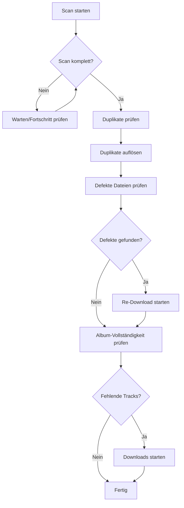

# Library Management

> **Version:** 1.0  
> **Last Updated:** 2025-11-25

---

## Übersicht

Das Library Management bietet Werkzeuge zur Verwaltung und Wartung deiner Musikbibliothek. Du kannst Scans durchführen, Duplikate erkennen, defekte Dateien finden und Album-Vollständigkeit prüfen.

---

## Features

### Bibliotheks-Scan

Scanne deine Musikbibliothek um:

- **Neue Dateien entdecken**: Dateien, die manuell hinzugefügt wurden
- **Defekte Dateien finden**: Korrupte oder unlesbare Audio-Dateien
- **Duplikate erkennen**: Dateien mit identischem Inhalt

### Duplikaterkennung

- **Hash-basiert**: Identifiziert exakt gleiche Dateien
- **Metadaten-basiert**: Findet verschiedene Versionen desselben Tracks
- **Speicherplatz-Analyse**: Zeigt, wie viel Speicher durch Duplikate verbraucht wird

### Defekte Dateien

- **Erkennung**: Findet korrupte, unvollständige oder unlesbare Dateien
- **Re-Download**: Defekte Dateien automatisch neu herunterladen
- **Status-Tracking**: Übersicht über Repair-Fortschritt

### Album-Vollständigkeit

- **Spotify-Vergleich**: Vergleicht lokale Alben mit Spotify-Daten
- **Fehlende Tracks**: Zeigt, welche Tracks eines Albums fehlen
- **Bulk-Download**: Fehlende Tracks in einem Schritt herunterladen

### Statistiken

- **Bibliotheksgröße**: Gesamtgröße aller Dateien
- **Track-Anzahl**: Anzahl der Tracks in der Datenbank
- **Scan-Status**: Wie viel der Bibliothek wurde gescannt

---

## Nutzung über die Web-UI

### Bibliothek scannen

1. Navigiere zu **Library** → **Scan**
2. Wähle den zu scannenden Pfad
3. Klicke auf **Start Scan**
4. Beobachte den Fortschritt in Echtzeit
5. Nach Abschluss: Ergebnisse prüfen

### Duplikate bereinigen

1. Navigiere zu **Library** → **Duplicates**
2. Prüfe die gefundenen Duplikat-Gruppen
3. Wähle, welche Kopie behalten werden soll
4. Markiere Duplikate als "resolved"

### Defekte Dateien reparieren

1. Navigiere zu **Library** → **Broken Files**
2. Prüfe die Liste defekter Dateien
3. Klicke auf **Re-Download All** oder wähle einzelne aus
4. Der Download startet automatisch

### Album-Vollständigkeit prüfen

1. Navigiere zu **Library** → **Albums**
2. Filter nach "Incomplete"
3. Klicke auf ein Album für Details
4. Starte den Download fehlender Tracks

---

## API-Endpunkte

### POST `/api/library/scan`

Startet einen Bibliotheks-Scan.

**Request:**
```json
{
  "scan_path": "/music/library"
}
```

**Response:**
```json
{
  "scan_id": "scan-uuid",
  "status": "running",
  "scan_path": "/music/library",
  "total_files": 0,
  "message": "Library scan started"
}
```

### GET `/api/library/scan/{scan_id}`

Ruft den Status eines laufenden Scans ab.

**Response:**
```json
{
  "scan_id": "scan-uuid",
  "status": "running",
  "scan_path": "/music/library",
  "total_files": 1500,
  "scanned_files": 750,
  "broken_files": 5,
  "duplicate_files": 12,
  "progress_percent": 50.0
}
```

**Status-Werte:**
- `running`: Scan läuft
- `completed`: Scan abgeschlossen
- `failed`: Scan fehlgeschlagen

### GET `/api/library/duplicates`

Gibt alle Duplikat-Gruppen zurück.

**Query-Parameter:**
| Parameter | Typ | Default | Beschreibung |
|-----------|-----|---------|--------------|
| `resolved` | bool | null | Filter nach resolved Status |

**Response:**
```json
{
  "duplicates": [
    {
      "hash": "abc123",
      "duplicate_count": 3,
      "total_size_bytes": 45000000,
      "files": [
        {"path": "/music/Artist/file1.mp3"},
        {"path": "/music/Artist/file1(1).mp3"},
        {"path": "/music/backup/file1.mp3"}
      ],
      "resolved": false
    }
  ],
  "total_count": 15,
  "total_duplicate_files": 42,
  "total_wasted_bytes": 500000000
}
```

### GET `/api/library/broken-files`

Gibt alle defekten Dateien zurück.

**Response:**
```json
{
  "broken_files": [
    {
      "id": "file-uuid",
      "track_id": "track-uuid",
      "file_path": "/music/Artist/broken.mp3",
      "error": "Invalid MP3 header",
      "detected_at": "2025-01-15T10:00:00Z"
    }
  ],
  "total_count": 5
}
```

### GET `/api/library/broken-files-summary`

Gibt eine Zusammenfassung der defekten Dateien zurück.

**Response:**
```json
{
  "total_broken": 5,
  "pending_redownload": 2,
  "redownloading": 1,
  "fixed": 2,
  "failed": 0
}
```

### POST `/api/library/re-download-broken`

Queued defekte Dateien zum Re-Download.

**Request:**
```json
{
  "priority": 10,
  "max_files": 10
}
```

**Response:**
```json
{
  "queued_count": 5,
  "skipped_count": 0,
  "message": "Queued 5 broken files for re-download"
}
```

### GET `/api/library/stats`

Gibt Bibliotheks-Statistiken zurück.

**Response:**
```json
{
  "total_tracks": 5000,
  "tracks_with_files": 4800,
  "broken_files": 5,
  "duplicate_groups": 12,
  "total_size_bytes": 50000000000,
  "scanned_percentage": 96.0
}
```

### GET `/api/library/incomplete-albums`

Gibt unvollständige Alben zurück.

**Query-Parameter:**
| Parameter | Typ | Default | Beschreibung |
|-----------|-----|---------|--------------|
| `incomplete_only` | bool | true | Nur unvollständige Alben |
| `min_track_count` | int | 3 | Minimum Tracks (filtert Singles) |

**Response:**
```json
{
  "albums": [
    {
      "album_id": "album-uuid",
      "album_name": "Greatest Hits",
      "artist_name": "Artist",
      "expected_tracks": 15,
      "actual_tracks": 12,
      "missing_tracks": ["Track 3", "Track 7", "Track 14"],
      "is_complete": false,
      "completeness_percent": 80
    }
  ],
  "total_count": 20,
  "incomplete_count": 8
}
```

### GET `/api/library/incomplete-albums/{album_id}`

Gibt Details zur Vollständigkeit eines Albums zurück.

**Response:**
```json
{
  "album_id": "album-uuid",
  "album_name": "Greatest Hits",
  "artist_name": "Artist",
  "expected_tracks": 15,
  "actual_tracks": 12,
  "missing_tracks": [
    {
      "track_number": 3,
      "title": "Missing Track",
      "spotify_uri": "spotify:track:xyz"
    }
  ],
  "is_complete": false,
  "completeness_percent": 80
}
```

---

## Scan-Prozess

### Was wird gescannt?

Gemäß `LibraryScannerService` und `ScanLibraryUseCase`:

- Alle Audio-Dateien (MP3, FLAC, M4A, OGG, etc.)
- Metadaten aus ID3-Tags (via mutagen)
- Datei-Integrität (Header-Validierung)
- File-Hashes für Duplikaterkennung
- Technische Audio-Infos: Bitrate, Sample-Rate, Format, Dauer

> **Aus Quellcode:** Der Scan-Pfad wird mit `validate_safe_path()` validiert. Es sind nur Pfade innerhalb von `download_path` oder `music_path` erlaubt (Sicherheitsmaßnahme gegen Directory-Traversal).

### Scan-Dauer

Die Scan-Dauer hängt ab von:
- Anzahl der Dateien
- Festplatten-Geschwindigkeit
- Ob Duplikat-Checks aktiviert sind

> **Aus Quellcode:** Der Scan speichert Fortschritt alle 100 Dateien in die Datenbank (siehe `ScanLibraryUseCase`). Dies ermöglicht Echtzeit-Progress-Updates ohne zu viele DB-Schreibvorgänge.

---

## Duplikat-Auflösung

### Automatische Empfehlung

Das System empfiehlt, welche Datei behalten werden sollte basierend auf:

1. **Qualität**: Höhere Bitrate/besseres Format
2. **Vollständigkeit**: Mehr Metadaten
3. **Pfad**: Bevorzugt organisierte Verzeichnisse

### Manuelle Auflösung

Du kannst manuell wählen:
- Welche Datei behalten werden soll
- Ob Duplikate gelöscht oder nur markiert werden
- Ob eine Zusammenführung der Metadaten stattfinden soll

---

## Workflow-Beispiel

### Vollständiger Bibliotheks-Wartungszyklus



---

## Best Practices

### Regelmäßige Scans

- **Wöchentlich**: Schneller Scan für neue Dateien
- **Monatlich**: Vollständiger Scan mit Integritätsprüfung

### Duplikat-Prävention

1. Organisiere Downloads in einem zentralen Verzeichnis
2. Verwende konsistente Namenskonventionen
3. Aktiviere automatische Duplikat-Erkennung bei Downloads

### Backup vor Bereinigung

Bevor du Duplikate löschst:
1. Erstelle ein Backup der Bibliothek
2. Exportiere die Playlist-Daten
3. Prüfe die zu löschenden Dateien manuell

---

## Troubleshooting

### Problem: Scan bleibt hängen

**Mögliche Ursachen:**
1. **Netzwerk-Laufwerk**: Remote-Laufwerke können langsam sein
2. **Berechtigungen**: Keine Leseberechtigung für einige Verzeichnisse
3. **Defekte Datei**: Eine Datei blockiert den Scanner

**Lösung:** Prüfe die Logs für Fehler und starte den Scan neu.

### Problem: Falsche Duplikate erkannt

**Mögliche Ursachen:**
1. **Verschiedene Versionen**: Remaster vs. Original
2. **Hash-Kollision**: Sehr selten, aber möglich

**Lösung:** Prüfe die Dateien manuell vor dem Löschen.

### Problem: Re-Download schlägt fehl

**Mögliche Ursachen:**
1. **Track nicht auf Soulseek**: Der Track ist nicht verfügbar
2. **Keine Spotify-Daten**: Track hat keine Spotify-URI für die Suche

**Lösung:** Manuell nach einer alternativen Quelle suchen.

---

## Verwandte Features

- [Download Management](./download-management.md) - Für Re-Downloads
- [Metadata Enrichment](./metadata-enrichment.md) - Für Metadaten-Korrektur
- [Playlist Management](./playlist-management.md) - Für fehlende Playlist-Tracks
