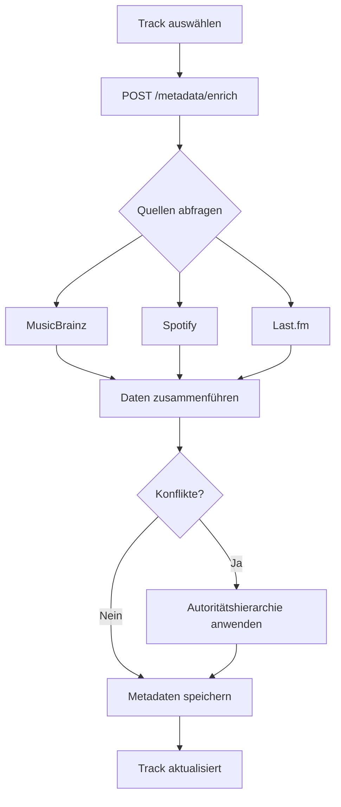

# Metadata Enrichment

> **Version:** 1.0  
> **Last Updated:** 2025-11-25

---

## Übersicht

Das Metadata Enrichment Feature reichert Track-, Artist- und Album-Metadaten aus mehreren Quellen an: Spotify, MusicBrainz und Last.fm. Es nutzt eine Autoritätshierarchie zur intelligenten Konfliktauflösung.

---

## Features

### Multi-Source Enrichment

Metadaten werden aus mehreren Quellen bezogen:

| Quelle | Datentypen | Priorität |
|--------|------------|-----------|
| **Manual** | Alle manuellen Änderungen | Höchste (1) |
| **MusicBrainz** | MBID, Genres, Release-Dates | Hoch (2) |
| **Spotify** | URIs, Popularität, Audio-Features | Mittel (3) |
| **Last.fm** | Tags, Scrobbles, ähnliche Artists | Niedrig (4) |

### Autoritätshierarchie

Bei Konflikten zwischen Quellen entscheidet die Priorität:

```
Manual > MusicBrainz > Spotify > Last.fm
```

Das bedeutet: Wenn MusicBrainz und Spotify unterschiedliche Genres liefern, wird MusicBrainz bevorzugt. Manuelle Änderungen überschreiben immer alles.

### Konfliktauflösung

- **Automatische Auflösung**: Basierend auf Autoritätshierarchie
- **Manuelle Auflösung**: Benutzer kann Quelle wählen oder eigenen Wert eingeben
- **Konflikt-Tracking**: Alle Konflikte werden protokolliert

### Tag-Normalisierung

Automatische Standardisierung von Tags:
- "feat." → "featuring"
- "ft." → "featuring"
- Genre-Normalisierung

---

## Nutzung über die Web-UI

### Track anreichern

1. Öffne die Track-Details
2. Klicke auf **Enrich Metadata**
3. Wähle die gewünschten Quellen
4. Klicke auf **Enrich**

### Konflikte auflösen

1. Öffne einen Track mit Metadaten-Konflikten
2. Wähle für jedes Feld die gewünschte Quelle
3. Oder gib einen eigenen Wert ein
4. Klicke auf **Save**

### Batch-Anreicherung

1. Navigiere zu **Library** → **Metadata**
2. Klicke auf **Fix All**
3. Alle Tracks mit fehlenden Metadaten werden angereichert

---

## API-Endpunkte

### POST `/api/metadata/enrich`

Reichert Metadaten eines Tracks an.

**Request:**
```json
{
  "track_id": "track-uuid",
  "force_refresh": false,
  "enrich_artist": true,
  "enrich_album": true,
  "use_spotify": true,
  "use_musicbrainz": true,
  "use_lastfm": true,
  "manual_overrides": {
    "genre": "Electronic"
  }
}
```

**Response:**
```json
{
  "track_id": "track-uuid",
  "enriched_fields": ["genre", "musicbrainz_id", "release_date"],
  "sources_used": ["musicbrainz", "spotify"],
  "conflicts": [
    {
      "field_name": "genre",
      "current_value": "Electronic",
      "current_source": "musicbrainz",
      "conflicting_values": {
        "spotify": "Dance",
        "lastfm": "Techno"
      }
    }
  ],
  "errors": []
}
```

### POST `/api/metadata/resolve-conflict`

Löst einen Metadaten-Konflikt manuell auf.

**Request:**
```json
{
  "track_id": "track-uuid",
  "field_name": "genre",
  "selected_source": "manual",
  "custom_value": "Progressive House"
}
```

**Response:**
```json
{
  "message": "Conflict resolved successfully",
  "entity_type": "track",
  "field_name": "genre",
  "selected_source": "manual"
}
```

### POST `/api/metadata/normalize-tags`

Normalisiert eine Liste von Tags.

**Request:**
```json
["Artist feat. Other", "Band ft. Singer"]
```

**Response:**
```json
[
  {
    "original": "Artist feat. Other",
    "normalized": "Artist featuring Other",
    "changed": true
  },
  {
    "original": "Band ft. Singer",
    "normalized": "Band featuring Singer",
    "changed": true
  }
]
```

### GET `/api/metadata/sources/hierarchy`

Gibt die Autoritätshierarchie zurück.

**Response:**
```json
{
  "manual": 1,
  "musicbrainz": 2,
  "spotify": 3,
  "lastfm": 4
}
```

### POST `/api/metadata/{track_id}/auto-fix`

Automatische Metadaten-Korrektur für einen Track.

**Response:**
```json
{
  "track_id": "track-uuid",
  "success": true,
  "enriched_fields": ["genre", "year"],
  "sources_used": ["musicbrainz"],
  "message": "Metadata auto-fixed successfully"
}
```

### POST `/api/metadata/fix-all`

Korrigiert Metadaten für alle Tracks mit fehlenden Daten.

> ⚠️ **Achtung:** Diese Operation kann bei großen Bibliotheken sehr lange dauern!

**Response:**
```json
{
  "message": "Metadata fix operation completed",
  "total_tracks": 1000,
  "tracks_to_fix": 50,
  "fixed_count": 45,
  "failed_count": 5,
  "status": "completed"
}
```

---

## Angereicherte Felder

### Track-Felder

| Feld | Quellen | Beschreibung |
|------|---------|--------------|
| `musicbrainz_id` | MusicBrainz | Eindeutige MusicBrainz Recording ID |
| `isrc` | Spotify, MusicBrainz | International Standard Recording Code |
| `genre` | MusicBrainz, Last.fm | Genre-Tags |
| `release_date` | Spotify, MusicBrainz | Veröffentlichungsdatum |
| `acousticness` | Spotify | Audio-Feature (0.0-1.0) |
| `danceability` | Spotify | Audio-Feature (0.0-1.0) |
| `energy` | Spotify | Audio-Feature (0.0-1.0) |

### Artist-Felder

| Feld | Quellen | Beschreibung |
|------|---------|--------------|
| `musicbrainz_id` | MusicBrainz | Eindeutige MusicBrainz Artist ID |
| `genres` | Spotify, MusicBrainz | Genre-Tags |
| `country` | MusicBrainz | Herkunftsland |
| `begin_date` | MusicBrainz | Gründungs-/Geburtsdatum |

### Album-Felder

| Feld | Quellen | Beschreibung |
|------|---------|--------------|
| `musicbrainz_id` | MusicBrainz | Eindeutige MusicBrainz Release ID |
| `release_date` | Spotify, MusicBrainz | Veröffentlichungsdatum |
| `cover_url` | CoverArtArchive | Album-Cover URL |
| `total_tracks` | Spotify, MusicBrainz | Anzahl der Tracks |

---

## Workflow-Beispiel

### Vollständige Anreicherung eines Tracks



---

## Best Practices

### Wann `force_refresh` verwenden

- Bei falsch erkannten Metadaten
- Nach manuellen Änderungen auf Spotify/MusicBrainz
- Bei neuen Releases

### Manuelle Overrides

Manuelle Overrides sollten verwendet werden für:
- Korrektur von Fehlern in externen Quellen
- Lokale Anpassungen (z.B. spezielle Genre-Klassifizierung)
- Nischenmusik, die nicht gut kategorisiert ist

---

## Troubleshooting

### Problem: MusicBrainz findet keinen Match

**Mögliche Ursachen:**
1. **Titel unterschiedlich**: Variationen wie "(Radio Edit)" oder "- Remastered"
2. **Seltene Musik**: Nicht alle Tracks sind bei MusicBrainz
3. **Rate-Limiting**: MusicBrainz erlaubt nur 1 Request/Sekunde

### Problem: Konflikte werden nicht gespeichert

**Lösung:** Stelle sicher, dass du explizit eine Quelle auswählst oder einen manuellen Wert eingibst.

### Problem: Spotify-Enrichment funktioniert nicht

**Mögliche Ursachen:**
1. **Token abgelaufen**: Authentifiziere dich erneut
2. **Track nicht auf Spotify**: Nicht alle Tracks haben Spotify-Daten

---

## Verwandte Features

- [Track Management](./track-management.md) - Manuelle Metadaten-Bearbeitung
- [Library Management](./library-management.md) - Bibliotheks-weite Operationen
- [Settings](./settings.md) - Konfiguration der Metadaten-Quellen
